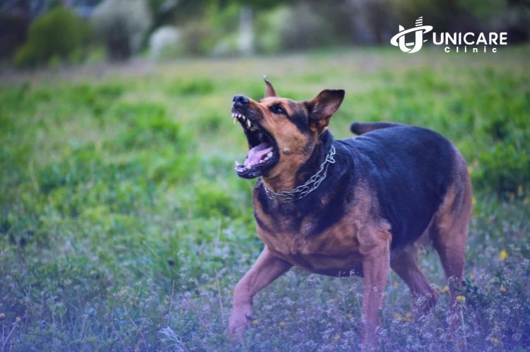

# Unicare Clinic Reforged - Work Summary
*Date: 2026-03-23*

---

## ALL TASKS COMPLETED

### 1. Updated index.html
- [x] Updated page title to "Unicare Clinic - Beyond Excellent Medical Service in Bali 2025"
- [x] Updated meta description
- [x] Updated hero section with Unicare branding
- [x] Updated emergency phone to +62 822 9829 8911
- [x] Updated location to Kuta, Ubud, Nusa Dua, Uluwatu
- [x] Updated hours to 24/7
- [x] Updated social media links (Facebook, Twitter/X, YouTube)
- [x] Updated services section with GP Doctor and 24 Hours Doctor On Call

### 2. Updated about-us.html
- [x] Updated page title to "About Us - Bali Medical Center Unicare Clinic"
- [x] Updated meta description
- [x] Updated page heading
- [x] Updated about content with Unicare description
- [x] Updated mission and vision references

### 3. Updated contact-us.html
- [x] Updated page title to "Contact Us - Unicare Clinic Bali & NTT Medical Center 2026"
- [x] Updated meta description
- [x] Updated phone to +62 822 9829 8911 (24/7 Hotline)
- [x] Updated email to [email protected]
- [x] Updated hours to Open 24/7

### 4. Downloaded Images (25 files)
All images saved to: `assets/images/unicare/`

**Logos:**
- logo-original.webp (18.5 KB)
- logo-white.webp (5.4 KB)

**Hero Images:**
- hero-main.webp (96.3 KB)
- hero-secondary.webp (60.9 KB)

**About Us Images:**
- about-main.webp (81.6 KB)
- about-secondary.webp (45.1 KB)

**Contact Us Images:**
- contact-main.webp (80.0 KB)
- contact-secondary.webp (65.1 KB)

**Service Images (18 files):**
- service-gp.webp - General Practitioner
- service-doctor-on-call.webp - 24 Hours Doctor On Call
- service-rabies.webp - Rabies Vaccine
- service-iv-drip.webp - IV Drip Therapy
- service-bali-belly.webp - Bali Belly Treatment
- service-dengue-test.webp - Dengue Test
- service-dengue-vaccine.webp - Dengue Vaccine
- service-wound-care.webp - Wound Care
- service-tomcat-rash.webp - Tomcat Rash Treatment
- service-ear-care.webp - Ear Care
- service-dental.webp - Dental Clinic
- service-std-test.webp - STD Test
- service-medical-checkup.webp - Medical Check Up
- service-premarital.webp - Premarital Check Up
- service-stem-cell.webp - Stem Cell Therapy
- service-psychiatrist.webp - Psychiatrist
- service-ambulance.webp - Ambulance Service
- service-wellness.webp - Medical Wellness Program

### 5. Created Documentation Files

**LIVE_SITE_CONTENT.md**
- Complete scrape of https://unicare-clinic.com/
- Homepage content
- About Us page content
- Contact Us page content
- All 18 services with full descriptions
- All 6 locations with addresses
- Image URLs
- Social media links
- Copyright info

**COMPARISON_REPORT.md**
- Detailed comparison of local vs live site
- Content changes summary
- New services identified
- Updated contact information
- Navigation menu changes
- New pages needed list
- Action items checklist

---

## NEW SERVICES IDENTIFIED (Since 2025)

1. Bali Belly Treatment
2. Dengue Test
3. Tomcat Rash Treatment
4. Stem Cell Therapy
5. Psychiatrist
6. Medical Wellness Program

---

## ALL UNICARE LOCATIONS

### Bali (4 locations):
1. **Central Parkir Kuta** - Ring No.2, Jl. Patih Jelantik, Kuta
2. **Uluwatu** - Uluwatu St No.88, Pecatu
3. **Ubud** - Jl. Raya Pengosekan No.88
4. **Nusa Dua** - Jl. Siligita, Benoa

### NTT (2 locations):
5. **Labuan Bajo** - Jl. Pantai Pede
6. **Tambaloka** - Jl. Sapurata

---

## UNICARE CONTACT INFORMATION

- **Phone:** +62 822 9829 8911 (24/7 Hotline)
- **Email:** [email protected]
- **Hours:** Open 24/7, Every Day
- **Social Media:**
  - Facebook: https://www.facebook.com/Unicare-Clinic-1936150369754527/
  - Twitter/X: @unicare_clinic
  - YouTube: Available

---

## FILES TO UPDATE NEXT

These files still need updating with Unicare content:

1. **services.html** - Update with Unicare's 18 services
2. **services-single.html** - Use as template for individual service pages
3. **appointment.html** - Update with Unicare contact info
4. **departments.html** - Update with Unicare departments
5. **departments-single.html** - Update department pages
6. **doctors-*.html** - Update with Unicare doctors
7. **Footer sections** across all pages - Update with Unicare info

---

## IMAGE USAGE

To use the downloaded images in your HTML:

```html
<!-- Logo -->


<!-- Hero Section -->


<!-- Service Icons -->


<!-- etc. -->
```

---

*Work completed while you were away at 7:34 PM*
